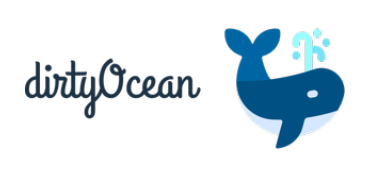

<div id="top"></div>

<div align="center">
  <a href="https://github.com/othneildrew/Best-README-Template">
    
  </a>

<h3 align="center">DirtyOcean - Hackathon</h3>

  <p align="center">
    Concientizar a las personas acerca de las consecuencias, producto de la contaminación en el océano, a través de una actividad interactiva.​
    <br />
    <br />
    <a href="">Ver Demo</a>
  </p>
</div>


<details>
  <summary>Tabla de Contenidos</summary>
  <ol>
    <li>
      <a href="#instalación-y-ejecución">Instalación y Ejecución</a>
    </li>
    <li><a href="#construido-con">Construido con</a></li>
    <li><a href="#licencia">License</a></li>
    <li><a href="#contacto">Contact</a></li>
  </ol>
</details>


## Instalación y Ejecución

1. Clona este repositorio
```bash
git clone "https://github.com/mmedinam1600/LaunchX-Hackaton.git"
```
2. Muevete a la carpeta Backend e instala los paquetes de npm necesarios del proyecto. `ocean-hackaton/Backend`
```bash
npm install
```
3. Asi mismo con la carpeta frontend. `ocean-hackaton/frontend`
```bash
npm install
```
4. Crea un archivo `.env` dentro de la carpeta Backend y pega los siguientes campos:
```dotenv
   DB_HOST=""
   DB_USER=""
   DB_PASSWORD=""
   DB_NAME=""
```
5. Completa los datos respectivos con tu base de datos. (No es necesario crear ninguna tabla, el programa lo hará automáticamente por tí)

6. Ejecuta el servidor (puerto Default: 8080) con: 
```bash
npm start
```

7. Muévete a la carpeta frontend e inicia el servidor (puerto Default: 3000) con:
```bash
npm run dev
```

## Como jugar

Tu misión será limpar la acumulación de plásticos que afectan a la diversa fauna del océano.<br>
<br>
Para ello deberás hacer lo siguiente:
* Clic derecho sobre la basura para recogerla.
* Por cada una se te otorgará 1 punto.
* Si seleciconas un pez por error, perderás 1 punto.
* Si te descuidas y el contaminante permanece demasiado tiempo sobre el agua, perderás 1 punto y se lo llevará la corriente.

## Construido Con

* [Node.js](https://nodejs.org/en/)
* [React.js](https://reactjs.org/)
* [Express.js](https://expressjs.com/)
* [StyledComponents](https://styled-components.com/)
* [AzureCloud](https://azure.microsoft.com/en-us/)
* [Sequelize](https://sequelize.org/)


## Licencia

Distributed under the GNU License. See `LICENSE` for more information.


## Contacto

Proyecto realizado por: 

- [Medina Martínez Diego R](https://github.com/diego200052).
- [Medina Martínez Miguel A](https://github.com/mmedinam1600).
- [Cortes Ramirez Roberto C](https://github.com/RobertoCarlos881).


<p align="right">(<a href="#top">back to top</a>)</p>
